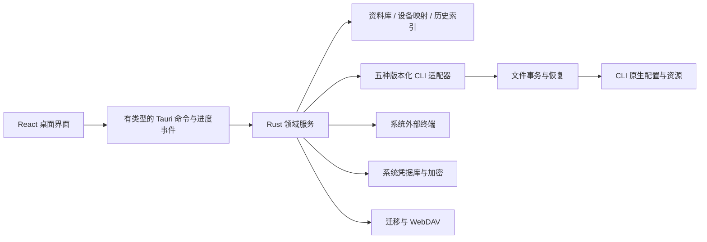

---
# Runtime 只读取这一处文件头机器区；不要在正文重复机器字段。
format: solution
# AI 在此填写非空摘要；正文由 owner 按阶段契约组织。
summary: "Tauri 2 + React/TypeScript + Rust 本地架构；UI 采用轻量侧栏与五工具首页、同工具多份原生配置/通用继承、原生托盘快捷菜单，覆盖 R22–R24 与 R4 接口格式/模型目录；保留五工具版本适配、保真事务、加密迁移同步和三平台真实验证条件。"
---
# 栖点 Cliora 技术方案

状态：修订后待确认。范围依据：[需求 R1–R24](../../requirements/2026-09-29-cli-tool-manager.md)。技术证据及可核验来源：[01 探索](01-exploration.md)。这是待实现的设计，不是完成报告。

本次设计以简单、直观、清晰为准：五个完整页面，原生文件直接可见，常用操作就近完成。便携性按用户确认解释为配置迁移方便、换设备容易恢复。设置可选择管理哪些 CLI；连接可选择原生支持的接口格式，模型优先尝试从供应商接口获取。

界面先看[可点击设计预览](../../design/cliora-preview.html)，以及[五页总览](../../design/cliora-pages.png)、[原生配置](../../design/cliora-native-config.png)、[设置](../../design/cliora-settings.png)、[接口格式](../../design/cliora-connection.png)、[浅色](../../design/cliora-light.png)、[深色](../../design/cliora-dark.png)、[托盘](../../design/cliora-tray.png)截图。预览使用示例数据，模型选项仅表达交互，不证明任何服务商/模型兼容性；原生能力仍以适配器和实际版本验证为准。页面不读写用户 CLI 配置，不产生真实启动或连接测试。

## 方案摘要与需要确认的取舍

交付可独立安装的三平台桌面管理应用，完整覆盖需求中的工具、项目、方案、MCP、Skills、模板、规则、历史、用量、导入导出与 WebDAV。采用 **Tauri 2 + React/TypeScript + Rust + SQLite**，所有实际文件写入、进程启动、凭据和同步由本机 Rust 层执行。

需要在本次方案确认中看清的两项取舍：

1. 首轮正式验收目标是 Windows 11 24H2 x64、macOS 14 arm64、Ubuntu 24.04 x64 桌面环境；每个环境测试全部五种 CLI。它们目前都是待测目标。其他系统版本/架构不自动列为首版已验证支持，也不以 WSL 替代 Windows。遇到 CLI 官方兼容范围不覆盖目标时必须修订目标或方案，不能伪造测试结果。
2. WebDAV 默认复用首次连接填写的密码或应用专用密码派生包装密钥，用户不用另设同步口令。该方案保护服务器上静态文件中的明文，但**不承诺对掌握该连接秘密的 WebDAV 服务方提供端到端保密**。无可复用秘密的认证方式，首次设置中导入一次随机连接恢复资料。离线导出使用当次设置的包口令，目标设备导入一次。详见 ADR-07。

本机目前只有 Windows 现场；其他桌面现场及分发签名是后续验收所需外部条件，不在方案阶段声称具备。功能开发可以推进，缺失证据时不能宣布 R2 或最终交付通过。

## ADR-01：桌面与领域边界

**依据**：仓库是绿地工程；R1/R7/R18 要求原生文件、系统凭据、外部终端与轻量日常体验。01 已核查 Tauri 系统依赖和桌面测试限制。

**决定**：React + TypeScript + Vite 提供界面，Rust 提供唯一领域服务，Tauri 仅作为桌面桥接与打包层。前端使用 CSS 设计令牌、可访问的基础控件和统一图标；不依赖在线服务才能显示本地管理页。SQLite（Rust 访问）承载资料、设备映射、操作日志和只读历史索引；正文资源存储在受控内容目录。依赖锁定在 lockfile，不凭“latest”接受未经核验的 API。



预期模块边界：`src/features/` 按工具、项目、资料、历史、统计、迁移与设置组织；`src-tauri/src/` 下分 `domain`、`adapters`、`config_tx`、`storage`、`secrets`、`terminal`、`history`、`sync` 和薄 `commands`。这只是实现落点，03 依可观察业务完成态拆任务，不按目录机械拆分。

IPC 不开放任意读文件、任意执行字符串的通用后门。前端提交实体 ID、目标范围、字段变更与预览版本；后端重新校验版本、路径归属和能力。错误统一包含用户可理解的原因与修复动作，敏感原文不直接穿透。每次后台操作有 ID、阶段、可取消状态和各目标结果；取消安装须说明可能已有外部变更并重新检测。

**取舍**：不采用 Electron，原因是本项目没有既有 Node 后端可复用，Rust 便于集中处理文件与系统能力；代价是双语言工程及不同 WebView 行为，必须纳入原生测试。浏览器模式仅供开发测试，不作为桌面完成态。

## ADR-02：五种 CLI 独立适配，能力跟随版本

**决定**：每个工具实现统一的业务接口、独立的原生映射。接口包括 discover/probe、readConfig、capabilities、prepareChanges、installOrUpgrade、launch/resume、readHistory。描述共同目的，不强行统一底层字段。

`ToolInstallation` 保存可执行文件、真实版本、来源和检测时间；安装状态与配置状态分开记录，界面组合呈现未安装、可用、配置不完整、版本不兼容、检测失败。探测采用路径候选 + 限时版本命令 + 工具身份检查，隔离输出并截断。发现多个安装时保留全部候选及当前选项。文件存在不能证明可运行；普通扫描不安装依赖、不触发登录和付费模型调用。

能力记录至少区分工具版本、平台、global/project、字段/传输、支持/不支持/未知、原因与验证依据。已知配置但版本未覆盖时允许查看和备份，只有可验证的写入能力才启用。不以把所有按钮禁用作为完成五工具支持的方式：安装、配置、启动三个基础流程必须实际成立。

| 工具 | 原生适配的主要落点 | 必须保留的差异 |
|---|---|---|
| Codex | 用户/受信任项目 TOML、模型供应商、MCP、原生 Skills/规则、会话源 | 账号登录与 API key 分离；CODEX_HOME 和层级来源；不改审批和沙箱策略来规避限制。 |
| Claude Code | 用户/项目/本地项目 JSON，以及独立 MCP 所在文件；CLAUDE.md、原生 Skills | 模型角色与环境变量优先级；登录和工具内部状态不当普通设置覆盖；安装来源对应升级方式。 |
| Grok Build | GROK_HOME/用户 TOML、项目允许字段、原生规则与资源、会话恢复 | 核实官方 grok 身份；项目字段逐项判定；resume 与新建 session-id 严格区分。 |
| Pi | agent 目录 settings/models/auth、项目 settings、原生 skills/规则、会话 | 不使用过时包名作为唯一安装路径；模型目录和凭据分文件；MCP 与项目供应商能力先取固定版本证据。 |
| OpenCode | 用户/项目 JSON/JSONC、供应商及模型 ID、MCP、Skills、规则、会话源 | 多供应商共存，模型角色与高优先级配置源；保留 JSONC；按实际平台解析目录。 |

适配器交付必须附脱敏 fixture 的工具版本与来源、字段范围和真实验证记录。静态文档不覆盖运行版本；未知历史格式只读降级，未知写入格式拒绝应用。Pi 文档缺页由固定版本官方 schema/源码/CLI 输出补证；不得部署第三方桥接来补原生能力。

安装/升级显示具体来源、命令及进度，由明确动作触发；识别到现有包管理器就沿用，无法接管则提供官方指引和重检。依赖缺失指出实际项，不扫描时静默安装。支持主动格式检查、服务端连通检查和最小模型请求测试，三种结果分开；最后一种仅主动触发，使用所选配置且提示可能产生用量。目录不可用时保留已有模型与手填入口。

## ADR-03：资料、设备与原生生效配置分别建模

**决定**：客户端数据库存储意图与资料，目标 CLI 的原生文件仍是它实际读取的配置。导入已有配置时保留源文件、范围、读取指纹与未知字段，不宣称已接管全部内容。

| 数据分区 | 主要实体 | 迁移/同步 |
|---|---|---|
| 可迁移资料 | 管理 CLI 偏好、工具专属服务商/接口格式/模型定义、API secret 引用、命名方案、全局默认资料、项目定义、模板、规则、MCP/Skill 内容 | 按 R14 白名单序列化；密钥在加密载荷中恢复。 |
| 设备本地 | 项目 ID→实际目录、工具路径与来源、终端、当前活动方案、依赖映射、系统凭据引用、WebDAV 连接资料 | 不进入资料包或同步正文。 |
| 运行事实 | 原生读取快照、应用结果、备份、待恢复事务、日志、扫描缓存 | 不跨设备迁移；备份含密钥时受本机加密保护。 |
| 历史与统计 | 源记录索引、会话收藏、标准化用量、手动价格与统计覆盖信息 | 全部保持本地，避免导入产生本地消费记录。 |

实体用稳定随机 ID 标识，名称可重复而身份不变。项目换目录只更新本机映射；跨设备按 ID 关联，不按绝对路径或同名自动合并。命名方案按工具保存原生配置意图，支持复制、重命名、保存和应用；单工具应用只触碰该工具。

字段的有效视图返回值、来源、是否继承、是否可写与不确定原因；清除覆盖是删除对应原生键，重新显示全局来源。受管理配置、项目信任或启动环境影响时明确显示。项目不支持的字段不能落到全局文件“补齐”。

共享项目文件默认不写明文密钥；优先采用原生支持的用户级凭据/密钥引用。在该 CLI 原生机制允许前，不能以临时私有协议、后台代理或仅 Cliora 启动注入来冒充完整原生配置支持。写入原生必需的凭据形式时限制文件权限；退出 Cliora 后 CLI 仍可直接使用。

## ADR-04：保真写入、并发冲突与持久恢复

**依据**：R6/R8/R9/R11。TOML 用 toml_edit，JSONC 用 CST 编辑，严格 JSON 在编辑后按严格语法验证；拒绝重复键/歧义或无法解析内容。只处理选定字段/已管理资源，保留其余键与格式允许的注释。TOML 排版库的已知限制需通过样本显示，不能承诺全文件字节不变。

**决定**：所有原生写入共用 `ConfigTransactionService`，不让各功能各写一套备份机制。

1. 读取完整基线与文件身份、摘要、权限，解析生成字段级补丁；在写入前重读。用户未改字段的外部修改可自动合入，同一字段冲突保留双方，返回一次冲突决定。
2. 保存本机加密的原字节/权限备份和事务日志，先持久化；逐文件在同目录生成待写版本，重新解析、检查范围与磁盘状态。
3. 在应用内部按目标路径串行执行，使用平台安全替换；每一步落盘记录预期旧/新指纹。SQLite 与外部文件不存在共同原子提交，显式记录 prepared/applying/committed/recovery-needed 阶段。
4. 成功后复读核验，再记录资料库中的应用状态。失败时恢复仅仍匹配本事务已写版本的文件；出现外部新修改则保留现场和备份，标出具体路径，集中提供恢复或比较入口。
5. 重启先扫描未完成日志，核验各文件后完成恢复或显示受影响范围。无关工具继续可用；存在未决恢复的同一目标暂停新写入。恢复本身也生成可回退记录，失败不删除可用备份。

外部 CLI/编辑器不一定遵守文件锁，因此不声称对任意并发写入完全串行化。尽量缩短最终重读到替换的窗口，使用可用的句柄/锁/文件身份检查，写后检查；把可检测的竞争作为冲突处理。故障注入需覆盖写前、写后、日志落盘和数据库更新之间的中断。任一无法确保恢复的路径都不显示成功。

多文件单操作按一个事务展示；多 CLI 分发按每个目标事务独立记录，允许部分成功后仅重试失败项。UI 区分“已写入，下次会话生效”和“运行中会话已生效”；没有原生确认机制就不显示后者。

## ADR-05：外部启动与可复用资料的完整流程

**外部终端**：后端形成结构化 `LaunchSpec`，包含工具安装 ID、cwd、经过验证的参数与可选 resume ID。Windows 首选可用的 Windows Terminal，否则选择 PowerShell 终端；macOS 首选 Terminal；Linux 选择已探测的终端适配器。用户可指定可用终端。每种终端单独处理参数边界、引号与进程脱离，覆盖中文、空格及 shell 特殊字符；不能把路径、模型 ID 或会话 ID直接拼成任意 shell 源码。必要的短期启动文件不含 API 密钥，并采用严格序列化与清理。

启动前校验目录、工具与必需配置。启动结果表示终端/进程请求结果，不能表示模型连通；启动失败提供重试/改路径/换终端。进程不受应用退出生命周期管控，验证退出应用后 CLI 仍运行。恢复仅使用原生 resume 命令与明确 ID，不允许以空会话替代。

**MCP**：适配器定义传输和字段，保存命令/参数/URL/凭据引用与本机依赖槽；不自动启动服务器验证。多目标预览各自能力与范围，逐目标报告配置结果。停用按原生机制实现，原生不支持时给出说明和可用移除流程。

**Skills**：发现原生目录，读元数据；从本地、明确 Git 来源或 HTTPS 归档导入时固定获取结果，展示来源。整体保存正文和包内资源，记录内容摘要和安装目标；不执行安装包中的脚本。限制解压大小/数量、拒绝越界路径，符号链接或外部引用转为待映射依赖，不自动抓取任意本机目录。同名及外部变更走比较；先准备完整副本再替换；删除只涉及选中的受管理副本。原生无停用能力时不提供假开关。

**模板与规则**：模板支持本地持久化的标题/正文搜索、分类、项目关联、复制和 CRUD；复制不执行文本。规则库与实际规则文件分开，显示位置、层级与差异。覆盖已有规则集中确认一次，取消零变更。规则和 Skill 内嵌绝对路径不能靠字符串替换自动判定可迁移：检测可识别依赖，保留内容并标待映射；无法解释的正文不宣称已跨平台可用。

## ADR-06：只读会话索引和可解释用量

**决定**：按适配器指定的合法根读取历史，限制单文件和批次资源用量，不执行日志内容。优先采用原生导出/查询途径，否则使用版本化格式解析器。会话源保持只读。

索引键以工具、原生会话 ID、来源身份组成；缺少原生 ID 的记录用稳定来源标识，不能每次扫描随机生成。消息/事件按源偏移或原生事件 ID 去重，保存源指纹；源变更重建对应部分，完整扫描后处理已删除来源。扫描失败保留旧缓存并标过期，不把暂时不可读当已删除。

支持工具/项目/关键词搜索、部分记录显示、收藏持久化以及用户选定的 Markdown/JSON 导出。正文/工具输出按文本安全渲染；未支持的块注明缺失，不声称完整。原生恢复命令或 ID 缺失时禁用续聊并说明原因；目录丢失可重新关联。

用量标准化保留原始口径与可空字段：input/output/cache-read/cache-write 等，并记录它们是否包含于 input，汇总禁止重复叠加。累积事件取正确增量/终值，分支会话共享事件去重。每项费用必须有匹配的工具/模型价格、币种、单位、来源/手填及更新时间；缺价格、未知 token 或无法归属的项目不补零。日期筛选使用有来源的时间戳与本地时区边界。统计展示覆盖记录数、失败数与未知量，订阅不按 token 推导账单。

## ADR-07：本机保护与跨设备加密恢复

**本机决定**：Windows 系统凭据保护、macOS Keychain、Linux Secret Service 通过显式后端接入；采用已核对的 keyring-core/平台后端，测试后锁版本。客户端数据库只存 secret ID 和密文；本机随机主密钥存系统凭据库。UI 默认掩码，主动查看短时取值，日志和诊断递归脱敏，主动复制不写日志。Linux 凭据服务缺失或被锁时保留非敏感功能，提供解锁/安装系统凭据服务入口；不回退到明文文件。

**包格式决定**：一个版本化认证加密容器，同时用于离线资料包和 WebDAV 对象。使用随机 256-bit 数据密钥、XChaCha20-Poly1305 和每对象独立随机 nonce；算法由维护中的库提供。公开头仅含格式、KDF 参数、随机 salt、nonce、key epoch 和解密必需的非敏感标识，头作为认证附加数据；实体名称、路径、密钥和清单都进入密文。解密认证通过后再解压并检查大小、路径与 schema，上限同时约束不可信 KDF 参数和解压资源。

**离线包**：导出流程中设定一次包口令（可自动生成并复制），Argon2id 派生包装密钥；建议初始参数 64 MiB、3 次、4 lanes，依据目标设备基准设保守上限，参数随包记录。密文内保存资料及必要资源，独立包装数据密钥。导入时输入口令一次即可解密到新设备，与原设备系统密钥无关。选项、预览、冲突决定、应用目标在一个导入流程集中提交；没选目标只入库。

**WebDAV 默认体验**：首次连接以用户提供的密码/应用专用密码、独立 salt 和用途标识经 Argon2id 生成包装密钥，包装随机同步空间数据密钥；不把认证秘密当明文数据密钥，不将认证秘密放入远端。新设备用同一连接秘密和远端包装头即可解锁，本机再把所需秘密交系统凭据库保存，重启不重复询问。服务器可能知道连接秘密，这一威胁边界写入同步设置的简短帮助，不宣传服务方不可解密。该选择符合 R17 的静态加密与低负担要求，但不增加未要求的端到端承诺。

使用不同设备专用密码或无共享秘密的认证时，在首次连接流程中从已解锁设备或事先保存的恢复文件导入随机恢复资料；它是一次连接信息，不要求用户创建独立口令或额外账号。只凭远端密文和全新的无关登录秘密无法恢复，这一情况显示需原连接秘密/恢复资料，不创建空空间覆盖旧数据。可主动导出恢复资料，但普通同秘密连接不以额外备份步骤阻塞使用。

**凭据更换**：已解锁设备先测试新连接、用新秘密重包数据密钥并验证新包装可读，再发布新包装版本，最后更新本机连接并退役旧远端包装；中断保留旧有效版本和本机恢复状态。不默认为只有新密码就能解开旧包装。用户在服务器外部改密且尚无解锁设备时，允许补充旧密码或恢复资料。普通凭据轮换不是已泄露数据密钥的撤销；主动重建同步密钥需要新 epoch、重新加密和设备重新接入，禁止悄悄丢弃历史。

原生 CLI 必须持有它支持的凭据形式；Cliora 的系统加密不会虚假宣称原生 CLI 文件也已加密。OAuth/网页登录令牌只留原 CLI 管理，迁移采用 API key 白名单，不能把整个 auth 文件复制出去。原生备份可能包含令牌，因此仅本机加密备份，不进入资料迁移。

## ADR-08：同一资料模型服务导入与 WebDAV

**导入导出**：一个明确白名单 DTO 是 R14 的唯一范围定义，导出选择实体和必要的包内资源；绝对路径变为本机依赖槽，终端、安装、源代码、活动选择、日志、历史、OAuth 和 WebDAV 凭据永不进入 DTO。已有配置中的未知字段保留在原生快照，不通过“顺手打包整个文件”迁移。版本未知/损坏/解锁失败在暂存区终止，资料库不变。

导入解密验证后以 ID、内容版本和原基线生成新增/更新/冲突/待映射预览。确认之后数据库事务写入资料，再对选定原生目标调用 ADR-04。资料入库与各目标应用结果分开报告；失败目标可重试，既有有效资料仍可用。相同包重导幂等，取消在确认前不持久改变资料。活动方案选择只在用户本机明确应用后改变。

**WebDAV 协议**：一个活动目标、HTTPS 默认、凭据仅发送给配置的源；跨源重定向不携带 Authorization，不关闭证书校验。连接测试检查认证、读取、列表、写入以及初始化所需条件请求，使用独立测试资源并清理。缺少关键语义时显示具体不兼容原因，不能盲开自动同步。

不用“最后上传者覆盖整包”。以不可变、随机 ID 的加密提交对象记录资料变更，每次提交包含实体 ID、父版本集合、内容摘要/删除标记以及资源引用；资源先完整上传，最后上传认证过的提交清单。客户端只有取得并验证清单和全部资源才导入该提交。截断、缺资源和认证失败保持待完成/错误状态，不能当空包或成功版本。

每个实体形成因果版本图：不同实体自动合并，同一实体的父子版本按因果关系推进；并发版本保留双方为冲突，用户一次集中选择或合并，生成同时引用双方的解决版本。删除同样是有父版本的 tombstone；删除与离线编辑并发必须显式解决，离线旧副本不自动复活数据。v1 保留删除标记和版本依据，不做可能破坏离线恢复的自动历史垃圾回收；提供容量状态。

不可变对象避免多设备共享覆写一个可变 head；初始化的空间 ID/加密包装版本用条件创建/更新验证，竞争失败重新读取，不重建空空间。目录列表可能延迟，客户端记录已知提交、补拉父节点和缺资源，不能仅按最大时间戳跳过内容。若目标服务无法可靠完成这些语义，保留本地操作并报告兼容性失败。

本地事务把资料修改与同步 outbox 一起提交；重复下载以提交 ID 幂等。离线期间可编辑、启动，恢复后重试。前台变更 debounce 约 2 秒、应用运行中周期轮询约 60 秒，失败采用带抖动的有限指数重试，达到上限后静默延后到下个周期或手动同步。退出应用停止自动同步并持久保存队列，不额外安装后台常驻服务。关闭同步保留本地资料；切换目标先做新目标预览，不自动清空旧远端。

“最近成功时间”只记录已确认完成的同步批次；冲突、待下载和失败单独计数。远端更新先入资料库，涉及本机活动配置时显示一次“应用更新”入口，遵循配置事务，不自动切换活动方案或改写运行中的 CLI。

## ADR-09：轻量导航、完整页面与简单日常操作

**决定**：采用浅色、低饱和绿色强调的桌面工具风格。左侧是低对比、窄导航，首页集中展示五种 CLI；不采用顶部切换单一 CLI 再列服务商的布局。用户最终要求恢复此前风格，外部参考不作为设计约束。

### 布局和视觉

```text
栖点 Cliora          准备好，开始工作
                    配置范围 [全局 / 项目 ▾]        启动目录 [cliora ▾]
快速开始            工具           当前命名配置 / 模型         操作
工具与连接          Codex          日常开发 ▾       2 份       启动 ···
资料库              Claude Code    日常开发 ▾       2 份       启动 ···
                    Grok Build     未配置                    ＋ 添加
                    Pi             日常编程 ▾                 启动 ···
                    OpenCode       日常编程 ▾                 启动 ···
使用记录
设置                最近项目：cliora → Codex / website → Claude Code
```

五项导航均为主窗口完整页面：快速开始、工具与连接、资料库，以及底部的使用记录、设置。页面使用相同的标题、工具栏、内容和动作顺序。参考 01 中导航与模态实践，长内容和多步任务留在页面内；短选择、短连接表单和必要确认才使用弹窗，不嵌套弹窗。

| 页面 | 用户首先看到 | 主要操作与次级内容 |
|---|---|---|
| 快速开始 | 已选择管理的工具、当前配置、启动目录 | 两次点击切配置，一次启动；编辑进入工具页相应条目。未配置时给创建入口。 |
| 工具与连接 | CLI 选择、命名配置列表、宽编辑区 | 默认直接显示 `config.toml` / `settings.json` 等文件；常用设置与合并结果并列，MCP/Skills 是同页标签。 |
| 资料库 | 提示词/长期规则、搜索、项目筛选 | 复制或进入完整正文编辑页；返回保留筛选和草稿。 |
| 使用记录 | 会话列表和正文、工具筛选 | 在原 CLI 继续；用量作为页内标签，缺失数值显示未知。 |
| 设置 | 管理的 CLI、托盘行为、外观 | 迁移与同步作为页内标签；导入预览、目录关联、WebDAV 表单使用完整子页。 |

主导航切换保留选择、搜索、滚动和待编辑草稿。每个编辑子页提供明确返回入口；原生文本编辑区和保存动作不被狭窄侧栏限制。管理工具选择、连接接口格式和模型列表的行为见 ADR-12。

默认窗口建议 1160×760 逻辑像素；导航宽约 180，正文左右留白 28–34，工具行约 72 高，组间距 24–28。五工具统一对齐名称、当前配置和启动动作，卡片只用于最近项目等不同对象。宽度不足时导航压缩/变为顶部可见入口，条目内配置换行，主要操作不溢出。项目选择器和启动目录分别标注，修改启动目录不会隐式修改配置范围。

浅色令牌：正文 `#242a25`、次文字 `#636c64`、强调 `#356947`、轻选中底 `#eaf2e9`、边框 `#e4e8e1`；深色正文 `#e7ece5`、次文字 `#a6b2a7`、强调 `#abd1ac`。主文字 14、工具/条目标题 13–15、页面标题 25；来源/地址 12 左右，非关键辅助信息最低 11。控件圆角 7–8，分组 10–12。颜色之外保留文字状态、勾选和焦点描边；正文与控件按 WCAG AA 对比度验证，不用淡色隐藏关键状态。

### 高频路径与状态

| 操作 | 交互 | 结果边界 |
|---|---|---|
| 切已保存配置 | 在对应工具行点击当前配置，选目标，共 2 次 | 只写该工具和当前范围，成功后更新选中；失败保留原状态。 |
| 启动 CLI | 已选目录时点工具行启动，1 次 | 启动请求不代表模型连通；失败直接提供目录/终端/登录修复。 |
| 编辑模型/原生配置 | 工具行编辑按钮进入对应完整配置页 | 同一 CLI 内选择多份命名配置；编辑与活动配置切换分开，见 ADR-11。 |
| 使用最近项目 | 点击项目的启动按钮，1 次 | 使用该项目已保存工具和原生配置，不偷偷切全局。 |
| 未配置工具 | 明确显示未配置，点击添加 | 不伪造当前模型；安装状态另行检测，没配置不等于没安装。 |
| 项目配置 | 选择项目后仍在原位置操作 | 标注继承全局；不支持字段显示原因，不回退全局写入。 |

命名配置选择器显示配置名、服务商/模型摘要与当前勾选，项目原生层级另标“继承全局”。配置内的“继承同工具通用配置”只在配置页表达，避免首页堆叠两种继承术语。首页所选工具同时可见，保留工具状态、当前模型和范围，满足 R18。

配置页采用“常用设置 / 原生文件名 / 合并结果”标签，默认打开原生文件；多文件工具提供文件选择，合并结果只读且提供逐字段来源。常规表单与原生文本是同一草稿，不允许切标签丢改动。模型目录失败仍可手填。保存活动配置时按钮明确影响目标；保存非活动配置不抢占当前选择。

操作进度就地显示，独立扫描/安装/同步不锁窗口。未安装、格式错误、未知版本、缺凭据、外部冲突均给出真实下一步；只有真实覆盖/删除/冲突/系统授权进入必要确认。首次打开自动检测且空状态真实，无假示例或“已验证”标签进入产品。

键盘按视觉顺序遍历；切换器可搜索、上下移动、回车确定，Esc 关闭并把焦点返回触发控件。未保存表单只有实际会丢内容时提醒。工具图标有可读标签，核心操作不只靠 hover/快捷键；验证 100/150/200% 缩放、长路径、浅深主题和减少动效。长配置列表支持搜索与稳定排序，不把最常用操作藏在滚动末端。

### 迁移与恢复

迁移入口固定在“设置 → 迁移与同步”。导出选择资料并设置配置包口令；导入选择与解锁、预览冲突和关联目录、显示结果，共三个阶段。已有密钥和通用继承随加密包迁移，CLI 网页登录状态与本机绝对路径不伪装为可搬运内容。未关联目录可稍后完成，不阻止其他可用配置恢复。WebDAV 是同页可选连接，不增加日常使用步骤。安全与冲突语义仍由 ADR-07 定义。

### 设计原型边界

[预览](../../design/cliora-preview.html)用浏览器内存演示配置选择、项目作用域隔离、主题、托盘共享选择、同工具多配置、通用继承开关、原生草稿与来源查看。原生文本编辑保存草稿但没有接入完整 TOML/JSONC 解析器；存在手改草稿时合并页明确标示待解析，不冒充实际合并。多文件凭据视图使用空示例，不读取本机登录数据。

预览的表单、安装与启动不执行真实操作；示例模型只是占位标签，必须由正式适配器按版本能力提供实际值。浏览器检查不能替代三平台桌面、系统托盘、CLI 加载和屏幕阅读器验收。

2026-09-29 浏览器预览检查：五项主导航均没有打开对话框；工具全关闭/恢复、项目范围隔离、原生草稿跨标签保留、通用继承、模型刷新与手填入口、接口格式持久到本次页面内存、空工具新增、资料草稿、会话筛选、导入预览和托盘状态联动通过。1360、900、640 像素三个视口下五页共 15 项横向溢出检查通过，无页面脚本异常。这些结果只覆盖示例交互，模型刷新没有发真实请求。

## ADR-10：托盘直接操作与窗口生命周期（R22）

**决定**：三平台共同提供原生托盘菜单，Windows 系统托盘、macOS 菜单栏、Linux 可用的 AppIndicator/托盘宿主。核心路径不依赖自绘浮窗或 Linux 不支持的图标点击事件。原生菜单使用系统主题与键盘行为，预览中的 HTML 菜单仅用于说明结构。

菜单顺序为：当前全局/项目范围 → 五工具各自子菜单 → 最近项目启动 → 打开栖点 → 退出栖点。每个工具行显示当前配置，一级子菜单直接列出已保存配置/模型摘要并标勾；工具→配置不再嵌套服务商→模型→方案三层。常用条目保持稳定排序，数量多时只在菜单提供固定/最近项和“管理全部”，完整资料仍在主窗口。

同一作用范围已确定的前提下，打开托盘、展开工具、点配置最多 3 次点击。选择项目范围是独立动作，不能在计数中隐藏。未配置工具给出配置/安装入口，未知能力不能伪装成可切换项目。单次切换直接调用 ADR-04，与主窗口共享资料、串行写入锁、操作 ID 和状态事件；成功后才移动勾选，失败保留旧状态与可访问错误项。冲突或目录映射需要处理时显示主窗口并直接定位受影响工具，而非回到首页让用户寻找。

默认关闭主窗口后保留托盘（设置可关闭），首次隐藏给出一次非阻塞说明；关闭主窗口不等于退出。托盘继续处理配置和已启用同步；“退出栖点”才停止同步、持久保存队列并结束进程，已启动的外部 CLI 独立运行。此行为细化 ADR-08 的“退出”，不新增独立系统服务，不默认启用开机启动。

托盘创建失败或运行时宿主不可用时不隐藏最后一个可访问窗口；保持任务栏/Dock 入口，重新启动应用应通过单实例机制唤醒主窗口。显式退出不在任务栏残留空入口。菜单数据按已提交状态生成，打开后发生并发更新时重新校验点击项版本，不按过期文本猜测目标。

发布验证覆盖三平台：主窗口隐藏仍可切换、当前范围和勾选一致、失败不改变选中、最近项目正确 cwd、键盘可用、明暗主题、完全退出、外部 CLI 存活、无托盘宿主时窗口可访问。Ubuntu 支持矩阵记录实际桌面和托盘宿主条件，不能用隐藏进程代替托盘支持。

## ADR-11：每个 CLI 多份原生配置及同工具通用继承（R23）

**决定**：工具安装、配置资料和应用绑定分别建模。每个 `toolId` 关联零到多份 `NativeProfile`（稳定 ID、名称、原生文件角色→内容、是否继承通用配置、版本）。每工具一份可选 `CommonConfig`，不能跨 CLI 共用原生字段。`AppliedBinding` 记录设备、工具、global/project 范围、profile ID、实际已应用版本/摘要，不用一个全局 activeProvider 字段覆盖所有工具。

多份配置可以使用同一服务商但不同模型、参数、MCP 或其他原生设置；因此“配置”不是服务商的别名。Codex、Claude 各自保存多份，Grok 可暂时零份；未配置工具只影响自身，不出现虚构的活动配置。工具选择页与托盘均列命名配置，不把多个配置变成多份 CLI 安装。

### 三层关系及唯一计算入口

1. 同工具通用配置：Cliora 资料中的共享基础。不是给 CLI 发明一个新的配置搜索路径。
2. 命名配置：按自身 `inheritCommon` 决定是否合入基础，再按字段显式覆盖。
3. 原生 global/project 与环境优先级：把计算后的补丁写入用户选择的原生范围，最终 CLI 是否采纳仍由原生层级、信任和环境决定。不能把 Cliora 合并预览标成已确定的最终运行值。

由 Rust 领域服务内唯一 `ProfileResolver` 按适配器的原生文档 schema 解析并计算。对象按字段递归合并，命名配置显式值优先，数组默认整体替换（仅官方明确不同语义时由适配器定义）；空字符串、false、0 都是显式值。清除覆盖是删除本配置键，回到通用值；不把 null 当通用删除操作。删除继承字段采用明确的抑制元数据，并在预览显示“此配置不应用该通用字段”，不能向原生文件插入虚构字段。

每个字段产出来源及受影响列表。JSON/JSONC/TOML 使用正式解析器，不靠字符串拼接拼通用文本；各文件角色分别解析，不把 auth、settings、MCP 混成一份。解析错误保留草稿，禁用应用，不以默认对象覆盖。未知合法字段保留；适配器限制项目范围不能写入的键。

### 写入、共同修改与删除边界

计算出 Common + Profile 后，向 ADR-04 提交最小字段补丁。记录上次由该应用绑定实际写入的键及指纹，切换时移除已不属于新配置的旧托管键（例如关闭继承后的旧通用字段），只在当前值仍匹配已写值时移除。外部用户修改按冲突处理，不把它们当托管残留删除；不管理的未知设置、登录身份、其他模型供应商保留。

编辑普通非活动配置只保存资料；编辑当前已应用配置时“保存并应用”明确工具与范围，成功后更新已应用版本。通用配置编辑页列出依赖配置数量以及实际活动的工具/范围，保存重新计算所有启用继承的资料，仅对本机当前依赖它的活动绑定应用变更；未启用继承的配置和本配置显式覆盖不变。多个目标结果分开呈现，失败保留旧绑定与待应用版本；备份与恢复复用 ADR-04，不增加一套不一致的写入机制。

原生视图按文件分标签/选择器，Codex 可以显示 config.toml 和凭据文件的受保护入口，Claude 等按实际版本的 settings/MCP/凭据分工。原生 JSON 密钥默认遮蔽并受控显露，OAuth 不进入普通可迁移草稿；不因为“支持原生配置”而整文件打包身份。文本与表单共享解析草稿，不能表单切回时清空未知字段、注释或用户尚未保存的文本。

删除通用配置须展示依赖影响并一次选择处理；删除命名配置不能留下悬空绑定，可选择保留现有原生文件作为未管理配置或切到另一合法配置，不自动重建原生默认文件。零配置状态可正常浏览其他工具。

### 迁移和验证

CommonConfig、NativeProfile 的定义、继承关系与可迁移原生字段归入 R14 白名单；本机 AppliedBinding、实际文件路径和已应用选择不迁移。导入/同步保留稳定 ID 和依赖关系，缺通用基础时显示待补全，不能悄悄当不继承。远端通用变更仍遵循 ADR-08：入库后由本机一次应用入口生效，不暗改本机配置。

验证需覆盖：每工具 0/1/N 份；Codex 和 Claude 独立切换；开启/关闭通用继承；值覆盖与清除；false/0/空值及数组；通用修改影响多个依赖且不影响其他工具；从共享基线移除旧托管键；原生多文件、未知字段、格式错误、文本/表单往返、外部修改冲突；项目层与通用层不混淆；托盘和主窗口选择及已应用版本一致。

## ADR-12：管理范围、连接协议与模型发现（R4、R24）

**决定**：管理的 CLI 集合是可迁移偏好。首页、工具页和托盘从同一集合派生；取消管理停止该工具的自动管理工作，不卸载、不修改原生文件、不删资料或记录，不终止外部会话。允许集合为空，主导航与设置始终可达；重新启用重新检测本机能力并恢复已有资料。新设备恢复偏好不意味着已安装。

每份连接保存供应商身份、接口格式、Base URL、认证引用与模型定义。接口格式使用适配器的版本化枚举与原生字段映射；在“编辑连接”直接选择。只有一种已知格式时显示固定值，不制造多余选择。已有未知格式保留原文并解释只读限制；地址相同不代表协议相同。切换格式保留地址、认证资料和已选模型，重新校验组合，不能偷偷切模型或转换协议。Pi 的 `api` 与 OpenCode 的 provider SDK 配置体现了不同原生映射，详见 01 的官方证据。

模型选择器首次打开时，有合法 API 连接且缓存缺失/过期就尝试后台查询供应商模型目录；有缓存先展示并标明来源与更新时间。保留搜索、刷新与直接填写模型 ID，不新增独立“模型管理”流程。请求由 Rust 服务完成，使用当前连接的认证与目录协议，处理分页、去重、超时、取消与限流；不由 WebView 暴露 API 密钥。请求按连接身份、地址、接口格式与认证版本隔离缓存，切换连接后迟到结果不得覆盖当前列表。修改地址/格式/认证时使对应缓存失效，日志不含秘密。

目录格式按供应商能力适配，不能把模型推理路径直接当成模型列表路径；原生订阅登录只在确有受支持的目录机制时使用，不能将订阅令牌搬到 API key 接口。无目录接口、401/403、429、超时、空列表和异常响应分别给简短反馈，保留原模型、旧缓存与手填。返回模型 ID 仅证明目录列出该项，CLI 兼容性和主动调用测试仍独立显示；不自动发收费推理请求。

**验证**：模型查询涵盖成功、分页、空结果、失败缓存、手填、切连接时竞态与协议变化；原生接口格式往返及迁移后保持；管理集合覆盖单项关闭、全部关闭、恢复、三入口一致与历史资料保留。预览仅演示选项和状态，正式实现须通过真实适配器和受控服务 fixture 验证。

## 需求覆盖与验证策略

下表指定完成态的直接观察点，后续 03 将其拆入业务任务和最终候选验证，不把文档、mock 或编译成功视为功能完成。

| 需求 | 方案落点 | 必须证明的行为 |
|---|---|---|
| R1–R3 | ADR-01/02 | 独立安装启动；15 个工具/平台组合能真实检测、安装或官方辅助安装、配置和外部启动；失败状态与安装来源真实。 |
| R4–R5 | ADR-02/03/12 | 原生 CLI 读取接口格式与配置；供应商目录获取/失败手填；两个项目互不串改；多供应商与模型角色保留；原登录可继续；单工具应用不影响其他工具。 |
| R6 | ADR-04 | 未知字段/注释样本、格式错误、外部非冲突/冲突、中断各阶段、权限拒绝和恢复失败；备份仍可用。 |
| R7 | ADR-05 | 三平台中文/空格/特殊字符目录进入正确 cwd；应用退出不终止 CLI；终端和目录失效可修复。 |
| R8–R9 | ADR-02/05 | 兼容 CLI 实际发现 MCP/完整 Skill 资源；分目标结果、重试失败项；冲突与更新失败保留原副本。 |
| R10–R11 | ADR-05/09 | 模板 CRUD/搜索/复制及重启；规则差异、一次覆盖确认、取消不变和真实原生加载范围。 |
| R12–R13 | ADR-06 | 真实版本 fixture 的部分损坏隔离、搜索/收藏/导出/恢复、刷新去重、源更新删除、费用未知与 token 口径。 |
| R14–R15 | ADR-03/07/08 | 在新数据目录/设备往返中文与资源；白名单排除敏感本机项；重复导入幂等，错误包与取消不变，路径待关联。 |
| R16 | ADR-08 | 双设备新增、独立编辑、同项并发、删除与离线旧编辑、断网/鉴权/截断上传/坏格式；无关资料继续同步。 |
| R17 | ADR-07 | 三平台真实系统凭据库；包和远端无密钥明文；全新设备可恢复；重启免重复解锁；错误秘密/轮换中断不丢资料。 |
| R18 | ADR-09 | 五个完整页面、原生文件可见、草稿与选择保留、1–3 次点击主流程和范围可辨；三平台浅深主题、缩放与键盘现场；长任务不阻塞无关操作。 |
| R24 | ADR-12 | 设置选择管理工具，首页/工具页/托盘一致，全部关闭可恢复，资料不删除。 |
| R22 | ADR-10 | 托盘直接切换最多 3 次点击、与窗口一致、失败保留旧状态、隐藏/唤醒/退出与无宿主行为。 |
| R23 | ADR-11 | 每 CLI 0/1/N 原生配置、通用基础与覆盖来源、原生多文件编辑、解析失败保护与跨工具隔离。 |
| R19–R21 | 全局边界 | 只有外部执行，不内置终端/对话/代理；不引入模型网关、WSL/SSH 管理、账户团队系统、余额查询或在线市场。 |

测试分层：领域及文件事务采用临时目录/故障注入，适配器采用版本化脱敏 fixture，WebDAV 用可控服务验证并发和故障，UI 用组件/浏览器交互验证，最后补三平台实际打包安装与 CLI 联动。macOS 原生验收采用实际桌面脚本或人工记录，不能因 Tauri WebDriver 缺口跳过。每条发布证据记录 OS/架构、应用与 CLI 版本、命令/操作、结果及限制；真实付费模型请求只在有授权凭据时主动测试。

## 实施顺序、风险与后续入口

先建立桌面壳与持久化/凭据/事务基础，再完成五工具各自可验证的检测→读取→应用→外部启动闭环，同时接入共享状态的原生托盘，随后接入 MCP/Skills/规则/模板与历史统计，最后完成加密迁移和双设备同步，并持续做平台构建与原生验证。上述是依赖顺序，所有 R1–R24 都属于首版验收，不以阶段性演示代替最终交付。

高风险验证优先进入实现早期：Pi MCP/项目模型等版本缺口、三平台凭据后端、保真修改和崩溃恢复、终端参数传递、全新设备解密。某项证据推翻本方案时从工作流方案修订入口处理，不能自行缩减需求。

尚未具备的事实：实际可用的 macOS/Linux 验收环境、五工具固定版本记录、真实 WebDAV 目标、签名/公证条件。实现阶段可以生成构建和验证入口；需要这些外部条件才能完成相应验收。正式支持列表只从通过记录生成，未测保留待验，不填完成标记。

本方案确认后再形成 03 的任务 DAG 和正式交付验证入口，并按工作流自动进入执行。当前没有创建应用代码，也没有宣称功能或平台验证通过。
